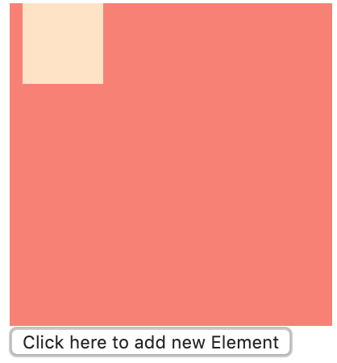

# C4TJS DOM - EXERCISE
## Get property (value, textContent, styles props, ...):
1. **Hiển thị chiều dài, chiều rộng của box:**
* Tạo 1 box có width: 300px, height: 200px và backgroundcolor bất kì
* Viết 1 đoạn code hiển thị ra width, height của box như hình.

_hint_: Sử dụng clientHeight / clientWidth

2. **Hiển thị nội dung text của box:**
* Tạo 1 box có width, height, backgroundcolor bất kì.
* Tạo 1 đoạn có nội dung là: `Đây là nội dung bằng chữ được đánh bằng máy tính` vào box
* Viết 1 đoạn code hiển thị ra nội dung của box như hình

3. **Hiển thị các box chung 1 class:**
* Tạo > 2 box có width: 150px, height: 150px, backgroundcolor bất kì và có chung 1 `class="box"`
* Đánh số thứ tự cho từng box
* Dùng `getElementsByClassName` lấy và in ra các thẻ có `class="box"`

## Add Event Listener:
1. **Add 1 sự kiện vào button:**
* Tạo 1 button có label là `Click here`
* Khi click vào button sẽ hiện ra chữ Clicked!

2. **Click vào button sẽ đổi màu và nội dung chữ:**
* Tạo 1 box bên trong có đoạn nội dung: `Đây là chữ chưa qua chỉnh sửa.`
* Tạo 1 button có label là `Click here to change color and text`
* Khi click vào button sẽ đổi màu và nội dùng của đoạn chữ thành `Tadaaa. Chữ sau khi được thẩm mỹ!!`

_hint_: [Style Property Element](https://www.w3schools.com/jsref/prop_html_style.asp)

3. **Click vào button sẽ đổi màu nền của box:**
* Tạo 1 box width, height, background-color bất kì.
* Tạo 1 button có label là `Click here to change background color box`.
* Khi click vào button sẽ đổi màu background của box như hình.

4. **Click vào button sẽ ẩn box:**
* Tạo 1 box width, height, background-color bất kì.
* Tạo 1 button có label là `Click here to hide box`.
* Khi click vào button box sẽ bị ẩn như hình.

## Parent / Children node elements:
1. **Click vào button add thêm box:**
* Tạo 1 box cha với width, height, backgroundcolor, padding tuỳ ý.
* Tạo 1 button có label là `Click here to add new Element`.
* Khi click vào button sẽ add thêm 1 box con có width: 50px, height: 50px, backgroundcolor: red vào box cha.

2. **Click vào button xoá box cuối trong box cha:**
* Tạo 1 box cha với width, height, backgroundcolor, padding tuỳ ý.
* Tạo 1 box con với width: 50px, height: 50px, backgroundColor: red trong box cha
* Tạo 1 button có label là `Click here to remove last Element`.
* Khi click vào button sẽ xoá box con.

